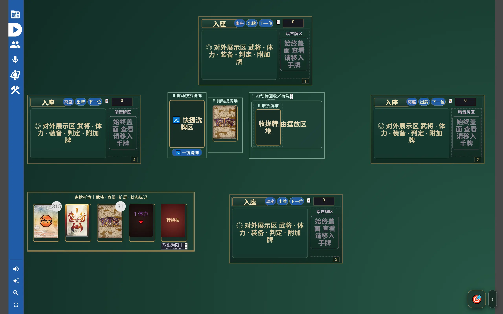
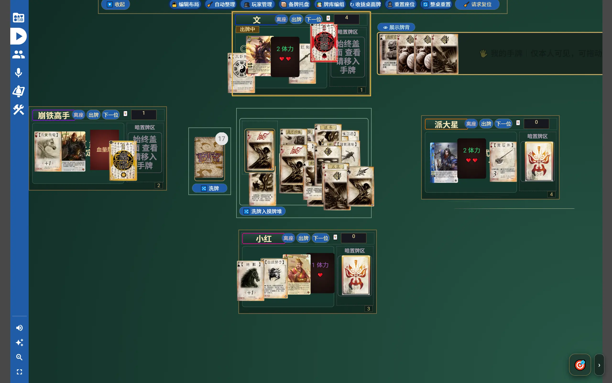

# 三国杀人工桌面（VirtualTabletop）

一个基于 [VirtualTabletop](https://virtualtabletop.io/) 的《三国杀》人工桌游实现。

本项目面向 **4--12 人联网人工桌**，通过 VTT提供在线桌面、牌库管理和多人协作体验。游戏规则由玩家自行裁定，不追求自动规则引擎，而是保留实体桌游的自由操作方式。

本仓库使用 TypeScript 生成可导入的 `.vtt` 游戏包。

## 1 它做什么

- 支持 4--12 人在线游戏
- 私密手牌与暗置区域
- 独立管理摸牌堆、弃牌回收区、公共区域和备牌托盘
- 支持扩展牌库筛选与导入
- 支持房主管理桌面布局
- 支持体力牌、转换技标记等人工状态管理

## 2 它不做什么

不实现、也不打算移植：

- 技能触发、出牌合法性、攻击距离
- 强制回合、响应链、自动伤害
- 手牌上限、自动胜负

即规则由桌上的人裁定。

## 3 快速开始

> 快速在线体验：https://vtt.insar.top/abcd

1.  获取最新 `.vtt` 游戏包
2.  导入到 VirtualTabletop 平台
3.  玩家加入对应席位
4.  开始游戏

## 4 构建

需要：

-   Node.js 22+
-   pnpm 10+

安装依赖：

``` bash
pnpm install
```

检查项目：

``` bash
pnpm check
```

构建：

``` bash
pnpm build
```

产物：

| 文件 | 说明 |
| --- | --- |
| `dist/Sanguosha-Manual-4-12P.vtt` | vtt 游戏包 |

包内是一份 `0.json` 和实际用到的 WebP 牌面。

## 5 平台

游戏包按  [ArnoldSmith86/virtualtabletop](https://github.com/ArnoldSmith86/virtualtabletop) 编写。**主体在原版上可运行**，即：你可以在原版VTT运行本游戏包，只有当你需要额外增加在线语音、更大的缩放等时才应该使用[Cc-Cece/virtualtabletop](https://github.com/Cc-Cece/virtualtabletop)。后者只增加可复用的平台能力。

| 平台仓库                                                     | 平台在线地址                |
| ------------------------------------------------------------ | --------------------------- |
| [ArnoldSmith86/virtualtabletop](https://github.com/ArnoldSmith86/virtualtabletop) | https://virtualtabletop.io/ |
| [Cc-Cece/virtualtabletop](https://github.com/Cc-Cece/virtualtabletop) | https://vtt.insar.top/      |

打 `v*` 标签发版后，会把游戏包同步进 fork 货架 `library/games/Sanguosha-Manual/`（直接推 `main`）。

| 能力 | 原版 VTT | [Cc-Cece/virtualtabletop](https://github.com/Cc-Cece/virtualtabletop) |
| --- | --- | --- |
| 游戏时主体功能 | 有 | 有 |
| 悬停放大 卡牌 | 有 | 有，且可本地调 50%–300% 预览 |
| 相机缩放 | 约 **1×–10×** | **1×–20×** |
| 「🎯 主区域」、进房对准 | 无镜头按钮/自动对准   | 有 |
| 房间内实时语音、说话标识 | 无（请用 Discord 等） | 有，需 HTTPS、STUN，人多时配 LiveKit |
| 管理台摸牌堆审计页面 | 无 | 有 |

## 6 截图

|  |  |
| ------------------------------------------------------- | ------------------------------------------------------- |

---

## 7 协作

欢迎提交 Issue 和 Pull Request，共同完善本项目。

欢迎通过 GitHub 提交：

- **Issue**：反馈问题、提出需求或讨论方案
- **Pull Request**：提交代码、资源整理或功能改进

提交 PR 前建议：

1. 保持现有项目结构
2. 避免引入与人工桌游理念冲突的自动规则逻辑
3. 对新增功能提供必要说明
4. 确保 `pnpm check` 可以通过

感谢每一位参与贡献的玩家与开发者。

## 8 许可证

原创源码（`src/`、`scripts/`、`tests/` 以及生成 `.vtt` 的逻辑）按 **[GNU GPL v3](LICENSE)**（`GPL-3.0-only`）授权。复制、修改、再分发源码时必须保留版权声明、许可证文本，并以 GPLv3 开源衍生作品。

牌面、封面、牌背等图像**不在本许可证范围内**。牌面等来自维护者对自有实体牌的扫描，美术版权仍归游卡等权利人。扫描不构成本项目的再许可。

本项目与游卡、网易、VirtualTabletop均无官方关系。


